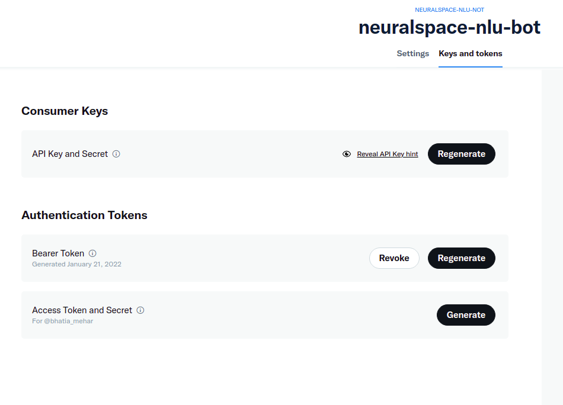
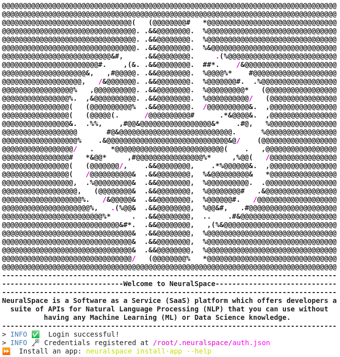

# NeuraLingo-Tutorial-TwitterBot-HateSpeech
This repository contains a tutorial to build a Twitter Bot that classifies hate and offensive tweets using NeuralSpace's NeuraLingo (NLU) API.  

Let us get started!

## Install requirements

To make the Twitter Bot in Python, we will need to install some packages. Let us make a conda environment. You can use Python >=3.6.

```
conda create --name neuralspace-nlu-bot python=3.6
conda activate neuralspace-nlu-bot
pip install tweepy==4.4.0
pip install pyyaml
```
As you see, we will use `tweepy`, a package that provides a very convenient way to use the Twitter API. Here is the [documentation](https://tweepy.readthedocs.io/en/latest/api.html). 

## Creating Twitter API Authentication Credentials
The Twitter API requires that all requests use OAuth to authenticate. So you need to create the required authentication credentials to be able to use the API. These credentials are four text strings:

- CONSUMER_KEY
- CONSUMER_SECRET
- ACCESS_TOKEN
- ACCESS_TOKEN_SECRET

If you already have a Twitter user account, then follow these steps to create the key, token, and secrets. Otherwise, you have to sign up as a Twitter user before proceeding.

### Step 1: Apply for a Twitter Developer Account
Go to the [Twitter developer](https://developer.twitter.com/en) site to apply for a developer account. Here, you have to select the Twitter user responsible for this account. It should probably be you or your organization. 

In this case, I chose to use my own account, `@bhatia_mehar`.

Twitter then requests some information about how you plan to use the developer account. You have to specify the developer account name and whether you are planning to use it for personal purpose or for your organization.

### Step 2: Create an Application
Twitter grants authentication credentials to apps, not accounts. An app can be any tool or bot that uses the Twitter API. So you need to register your an app to be able to make API calls.

To register your app, go to your [Twitter apps page](https://developer.twitter.com/en/portal/projects-and-apps) and select the Create an app option.


You need to provide the following information about your app and its purpose:

- **App name**: a name to identify your application (such as examplebot)
- **Application description**: the purpose of your application (such as an example bot for a Python article)
- **Your or your application’s website URL**: required, but can be your personal site’s URL since bots don’t need a URL to work
- **Use of the app**: how users will use your app (such as This app is a bot that will automatically respond to users)

### Step 3: Create the Authentication Credentials

To create the authentication credentials, go to your Twitter apps page. Here’s what the Apps page looks like:

Here you’ll find the Dashboard button of your app. Clicking this button takes you to the next page, where you can generate the credentials.

By selecting the Keys and tokens tab, you can generate and copy the key, token, and secrets to use them in your code:

After generating the credentials, save them in the `config.yaml` file to later use them in your code.

## Other credentials to pass through config.yaml

To run the twitter bot, there are some other credentials that you must save. 
For NeuralSpace NeuraLingo and Language Detection Authentication, you need the following. 
- MODEL_ID
- ACCESS_TOKEN

The `MODEL_ID` is extracted from the trained HateSpeech model from the Colab Notebook. The `ACCESS_TOKEN` can be extracted in two ways. 

### Extracting access token using CLI
After you login to neuralspace from the CLI using your emailID and password, you will find a link at the bottom where your credentials are saved. Open that and copy paste to the `config.yaml` file under `neuralspace-lang-detection-auth` and `neuralspace-nlu-auth`. 


### Extracting access token using Platform
After you login to the Platform, you will find the ACCESS_TOKEN at the top right of the screen beside `Shortcuts` and `API_KEY`. Copy the ACCESS_TOKEN and paste to the `config.yaml` file under `neuralspace-lang-detection-auth` and `neuralspace-nlu-auth`.

## All ready
If you would like to classify the top n tweets for a specific Twitter user_handle, enter the handle and the count in the config file under `twitter-query`. 

Then you are all-set. 

Run ```python src/neuralspace_nlu_bot.py```